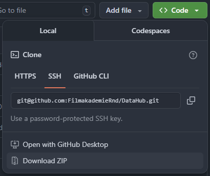
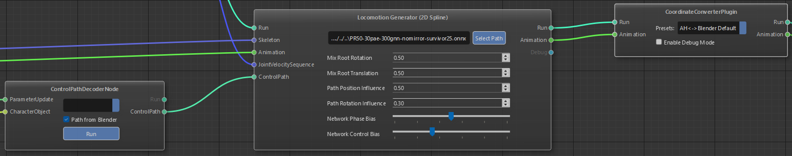
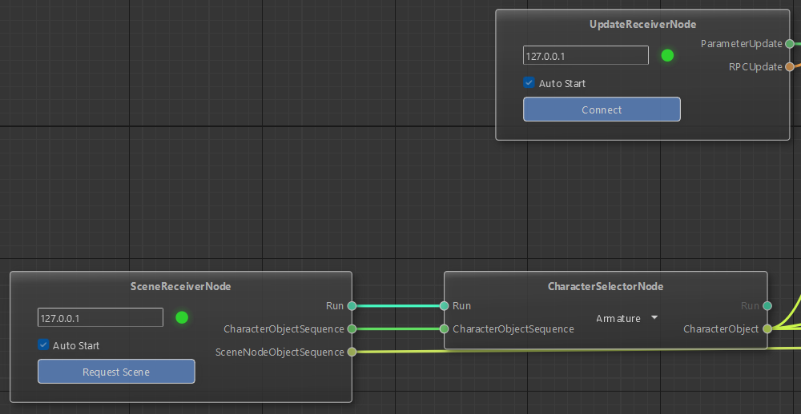

# Running Character Animation Inference

This guide walks you through running AI-powered character animation inference using trained models in the AnimHost pipeline. You will load a Gated Neural Network (GNN) model to generate character animations in real-time.

## Prerequisites

- **AnimHost Release**: Download the latest release from [AnimHost GitHub Releases](https://github.com/FilmakademieRnd/AnimHost/releases/tag/v0.1.0)
- **Trained Models**: Pre-trained ONNX models, available as an release asset.
- **Reference FBX file**: A reference FBX file as used in training is required to get the character skeleton definition, available as an release asset.
- **Demo blender scene**: The demo .blend scene, available as an release asset.
- **Blender**: Blender 4.2 (4.2.9 confirmed working, 4.1 does not work)

## Quick Start: Complete Inference Workflow

### Step 1: Setup Blender

1. Install the TracerSceneDistribution Blender add-on:
   - Download the latest add-on release from [TracerSceneDistribution GitHub Releases](https://github.com/FilmakademieRnd/TracerSceneDistribution/releases).
   - In Blender: **Edit → Preferences → Add-ons → Install**.
   - Select the add-on zip file and double check it is enabled after the install.
   - You will find it as `TRACER Add-On` in the sidebar (press `N` if not visible)
   - Open the plugin and check whether the `Install ZMQ` button is present, if so click it.

2. Open the Survivor character scene:
   - Use the `Survivor_Base_wPath.blend` scene file

For further information on how to use the Plugin to configure your own path see the add-on's [GitHub README](https://github.com/FilmakademieRnd/TracerSceneDistribution/blob/main/Blender/README.md). It is also available in the release zip file.

### Step 2: Run DataHub

DataHub facilitates communication between AnimHost and Blender.



1. Download the DataHub repo zip: [DataHub GitHub](https://github.com/FilmakademieRnd/DataHub)

2. Launch DataHub with the following command:
```powershell
cd .\DataHub\DataHub\
.\DataHub.exe -nl -np -ownIP 127.0.0.1 -d
```
- `-nl`: Run without lock history
- `-np`: Run without parameter history
- `-ownIP 127.0.0.1`: Set local IP address
- `-d`: Run with debug output

3. Keep DataHub running in the background during inference

### Step 3: Configure AnimHost for Inference

1. Launch `AnimHost.exe` from the release package

2. Load the inference pipeline: **File → Load Scene → TestScenes/TrainingPipeline.flow**

3. Configure the Animation Import node:
   - Select an animation example from your dataset (e.g., `Survivor_AnimHost_Mocap_Dataset_2025/FBX/Skeleton_Example`)
   - This serves as a reference skeleton for the inference system

4. The default configuration is expected to work as a starting point.
   - There is no need to explicitly start this pipeline because receiver nodes are set to `Auto Start`.
   - The `ControlPathDecoderNode` is set to `Path from Blender`.
   - The `CoordinateConverterPlugin` is set to `AH<->Blender Default`.
   - `Locomotion Generator (2D)` parameters are set to bias towards the control path. See the detailed parameter description below.



### Locomotion Generator Parameters

| Parameter | Range | Default | Description |
|-----------|-------|---------|-------------|
| **Mix Root Rotation** | 0.0 - 1.0 | 0.5 | Root rotation blend (0 = network, 1 = path) |
| **Mix Root Translation** | 0.0 - 1.0 | 0.5 | Root position blend (0 = network, 1 = path) |
| **Path Position Influence** | 0.0 - 1.0 | 0.5 | Pre-inference position blend (0 = strict path, 1 = loose) |
| **Path Rotation Influence** | 0.0 - 1.0 | 0.3 | Pre-inference rotation blend (0 = strict path, 1 = loose) |
| **Network Phase Bias** | 0 - 100 | 50 | Post-inference phase blend (0 = steady gait, 100 = fast tempo adaptation) |
| **Network Control Bias** | 0 - 100 | 33 | Post-inference trajectory blend (0 = ignore network, 100 = trust network) |

> **Note:** Settings of 0, 0, 1, 1, 100, 100 produce output closest to raw network predictions.

### Step 4: Request Animation in Blender


1. In Blender, with the `Survivor_Base_wPath` scene open, click all **red highlighted buttons**:
   - `Connect to TRACER`
   - `TRACER Character Setup`
   - `Start Path Operator`

2. Confirm that the AnimHost connector nodes both show a green light.

3. Request the AI charcter animation with the **Request Animation** button.



4. The trained model will generate animation based on:
   - The path/spline you defined in Blender
   - The control parameters set in AnimHost
   - The locomotion patterns learned during training

5. Once you see an animation received message on the bottom of the screen you can play the animation.

---

## About
 &nbsp;&nbsp;&nbsp;&nbsp;
 &nbsp;&nbsp;&nbsp;&nbsp;


AnimHost is a development by [Filmakademie Baden-Wuerttemberg](https://filmakademie.de/), [Animationsinstitut R&D Labs](http://research.animationsinstitut.de/) in the scope of the EU funded project [MAX-R](https://max-r.eu/) (101070072).

## Funding


This project has received funding from the European Union's Horizon Europe Research and Innovation Programme under Grant Agreement No 101070072 MAX-R.

## License
AnimHost is a open-source development by Filmakademie Baden-Wuerttemberg's Animationsinstitut.
The framework is licensed under [MIT](LICENSE.txt). See [License info file](LICENSE_Info.txt) for more details.
