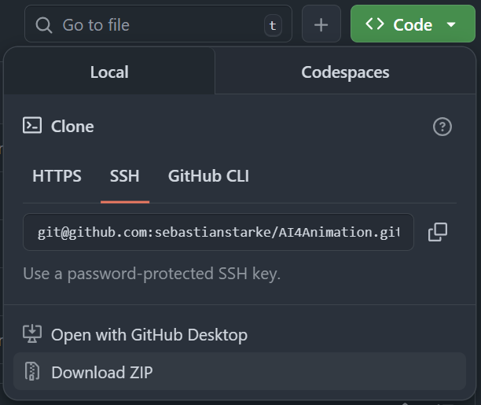
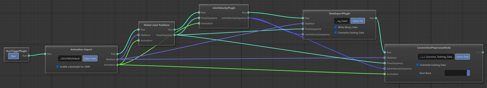
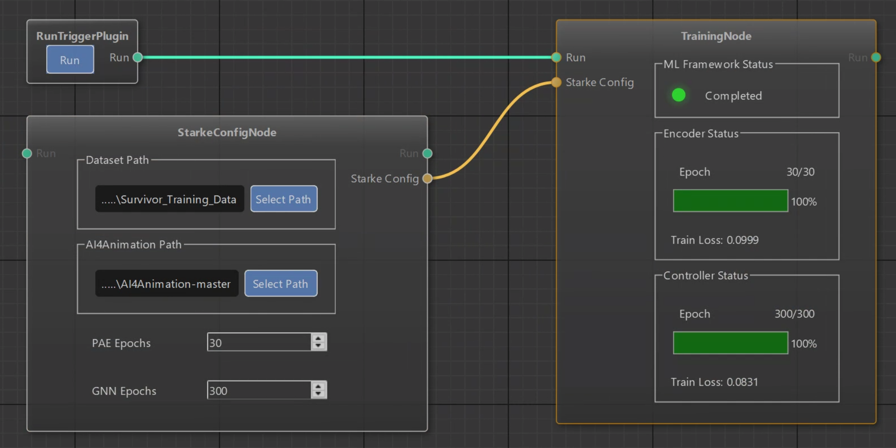

# Training Character Animation Models

This guide walks you through training AI-powered character animation models using the AnimHost pipeline and motion capture data. You will train a Periodic Autoencoder (PAE) and Gated Neural Network (GNN).

## Prerequisites

- **AnimHost Release**: Download the latest release from [GitHub Releases](https://github.com/FilmakademieRnd/AnimHost/releases)
- **Windows**: Windows 10/11 with PowerShell
- **GPU**: NVIDIA GPU recommended for faster training
- **Disk Space**: ~20GB for intermediate trained model onnx files (assuming 30 PAE and 300 GNN epochs)

## Quick Start: Complete Training Workflow

### Step 1: Download AI4Animation Framework

Download the [AI4Animation repository](https://github.com/sebastianstarke/AI4Animation) code as a zip file and unpack it next to your AnimHost release. The compressed repository is 3.3GB so this will take some time.



**Recommended directory structure:**
```
C:/My-AnimHost-Run/
├── AnimHost/
│   ├── AnimHost.exe
│   ├── TestScenes/
│   └── python/
└── AI4Animation-master/
    └── AI4Animation/
        └── SIGGRAPH_2022/
```

**Copyright Notice**: The external AI4Animation repo is only for research or education purposes, and not freely available for commercial use or redistribution.

### Step 2: Download Motion Capture Dataset

Download the *SURVIVOR AnimHost Motion Capture Dataset 2025* under the *ANIMHOST MOTION CAPTURE DATASET 2024 & 2025* section [here](https://animationsinstitut.de/en/research/projects/max-r). Place it alongside the AnimHost and AI4Animation directories. If you want to train without mirrored data you need to move the data files into their own dir (below Default).
```
C:/My-AnimHost-Run/
...
└── Survivor_AnimHost_Mocap_Dataset_2025/
    ├── FBX/
    │   ├── Default/
    │   │   ├── 01_....fbx
    │   │   └── 02_....fbx
    │   └── Mirror/
    │       ├── 01_...Mirrored.fbx
    │       └── 02_...Mirrored.fbx
    └── Survivor_Mocap_dataset_2025_Readme_License.html
```

### Step 3: Preprocess Motion Capture Data



1. Create a directory for your processed dataset. E.g.:
```
C:/My-AnimHost-Run/
...
└── Survivor_Training_Data/
```

2. Launch `AnimHost.exe` from the release package

3. Load the preprocessing pipeline: **File → Load Scene → AnimHost/TestScenes/Preprocessing.flow**

4. Configure the nodes:
   - In the *Animation Import* node select the SURVIVOR dataset directory *.../FBX/Default* (or *.../FBX/Test* with just a few files for small trial run dataset)
   - In the *DataExportPlugin* node select the output dir *C:/My-AnimHost-Run/Survivor_Training_Data*. Check the `Write Binary Data` and `Overwrite Existing Data` options.
   - In the *LocomotionPreprocessNode* select the output dir *C:/My-AnimHost-Run/Survivor_Training_Data* and `Overwrite Existing Data` option.

5. Click **Run** to generate training data files

This outputs preprocessed binary data (`data_x.bin`, `data_y.bin`) and metadata files needed for training. Expect 142 MB `data_x.bin` and 126 MB `data_y.bin` for the SURVIVOR 2025 dataset without mirrored data.

### Step 4: Train the Animation Model



1. In AnimHost, load the training pipeline: **File → Load Scene → TestScenes/TrainingPipeline.flow**

2. Configure the dataset node:
    - Select the `Dataset Path` you used, *C:/My-AnimHost-Run/Survivor_Training_Data*.
    - Select the `AI4Animation Path` you used, *C:/My-AnimHost-Run/AI4Animation-master*.
    - Set the `PAE epochs` and `GNN epochs` to 1 epochs for a ~15min trial run (including a few minutes for first time setup). Or the default values for a ~16 hours training run.

3. Click **Run** to start training. This will:
    - Automatically install Miniconda if not present (Windows only)
    - Create the `animhost-ml-starke22` conda environment
    - Train the Periodic Autoencoder (PAE) and Gated Neural Network (GNN)
    - Display real-time training progress in the UI

4. Confirm losses and runtime are consistent with the below reference.

### Training Run Reference

| Dataset | Epochs (PAE/GNN) | Final Losses (PAE/GNN) | Runtime |
|---------|------------------|------------------------|---------|
| SURVIVOR 2025 (without mirrored) | 30 / 300 | 0.10 / 0.08 | ~16 hours |
| SURVIVOR 2025 (without mirrored) | 1 / 1 | 0.13 / 0.33 | ~15 minutes |

*Runtimes measured on NVIDIA RTX A5000.*


## Outputs

After training completes successfully, training artifacts are automatically preserved in a unique run directory:

**Artifacts Location**: `AnimHost/artifacts/<username>_<date>_<count>/`


**Artifact Contents**:
- **Configuration**: `config.json` - Complete training setup for reproducibility
- **PAE Training Output**: `PAE/Training/` - Periodic Autoencoder models and checkpoints
- **GNN Training Output**: `GNN/Training/` - Gated Neural Network models and checkpoints
- **AnimHost log slice**: `LogOutput.txt` - AnimHost logging during the run

**Quick Access**: Click the **"View Run Artifacts 📁"** button in the TrainingNode widget to open the artifacts directory in Windows Explorer.

**Note**: If artifact preservation fails or is disabled, trained models remain in their original locations:
- `AI4Animation/SIGGRAPH_2022/PyTorch/PAE/Training/`
- `AI4Animation/SIGGRAPH_2022/PyTorch/GNN/Training/`

These trained models can be integrated into AnimHost for real-time character animation.


## Alternative Training Methods

For developers and advanced users, see [DEV_GUIDE.md](python/ml_framework/DEV_GUIDE.md) for:
- **Option 1**: Local build of AnimHost
- **Option 2**: Automated PowerShell launcher
- **Option 3**: Direct Python execution (cross-platform)
- Developer documentation and architecture diagrams
- Testing instructions


## Troubleshooting

**Issue**: The TrainingNode looks stuck at `One-time Env Setup`.
**Solution**: This does take some time because it downloads and installs larger libraries like PyTorch and Cuda. Do expect a few minutes. You'll only need this step for your very first run.

**Issue**: The TrainingNode looks stuck at `Starting training ...`.
**Solution**: Both the first and especially the second starting training steps need a few minutes to load the datasets into memory if you're using the full Surivor 2025 set. If you're giving this a trial run you can use only a few FBX files.

**Issue**: I'm getting a lot of `INFO || Non-JSON stdout:` output, e.g. during first time setup.
**Solution**: Output like this expected, especially during first time setup and during `Starting training ...`. The information is likely irrelevant for you unless you're debugging an issue.

For technical issues, see [DEV_GUIDE.md](python/ml_framework/DEV_GUIDE.md) or [open an issue](https://github.com/FilmakademieRnd/AnimHost/issues).

---

## About
 &nbsp;&nbsp;&nbsp;&nbsp;
 &nbsp;&nbsp;&nbsp;&nbsp;


AnimHost is a development by [Filmakademie Baden-Wuerttemberg](https://filmakademie.de/), [Animationsinstitut R&D Labs](http://research.animationsinstitut.de/) in the scope of the EU funded project [MAX-R](https://max-r.eu/) (101070072).

## Funding


This project has received funding from the European Union's Horizon Europe Research and Innovation Programme under Grant Agreement No 101070072 MAX-R.

## License
AnimHost is a open-source development by Filmakademie Baden-Wuerttemberg's Animationsinstitut.
The framework is licensed under [MIT](LICENSE.txt). See [License info file](LICENSE_Info.txt) for more details.
