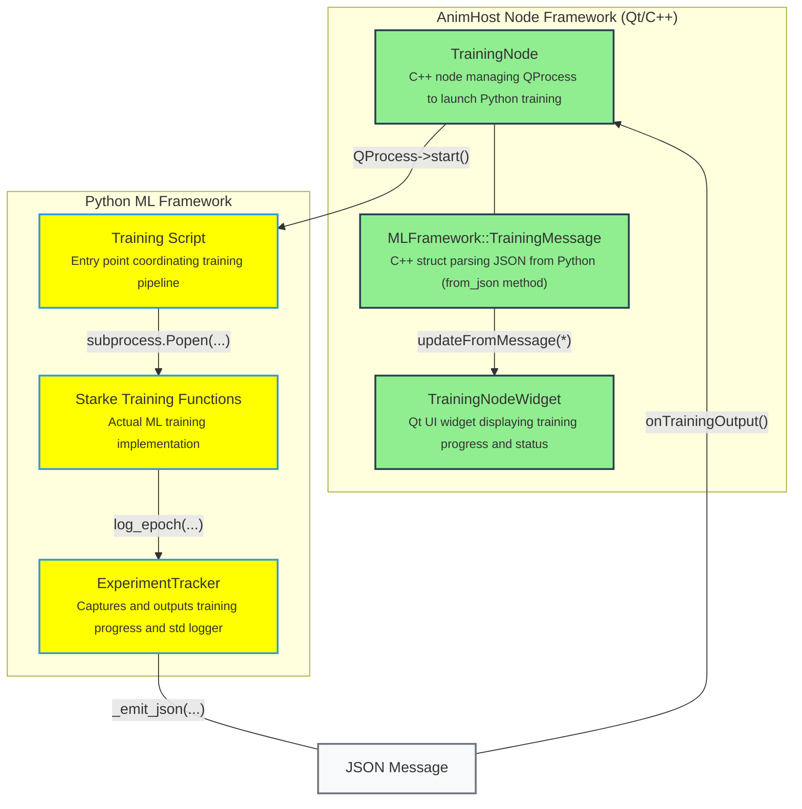

# ML Framework Developer Documentation



## Integration Overview

The TrainingPlugin bridges AnimHost's C++ node framework with Python ML training scripts via JSON inter-process communication. TrainingNode launches Python processes using QProcess, while ExperimentTracker provides structured logging from Python back to the UI.

**Critical Interface Requirement**: Any changes to the JSON protocol must be synchronized between:
- `ExperimentTracker._emit_json()` method in Python (emits JSON with status, text, metrics fields)
- `MLFramework::TrainingMessage.from_json()` method in C++ (parses the same JSON structure)

This ensures consistent communication between the Python training pipeline and AnimHost's UI components. At this point, this implicit interface is preferred over an explicit message structure for ease of iteration.

## External Training Script Integration

External training scripts (like Starke SIGGRAPH 2022's Network.py) are integrated as subprocesses with customized line parsers:

```python
# Example from starke_training.py
run_script_subprocess(
    script_name="Network.py",
    working_dir=gnn_path,
    model_name="Controller", 
    line_parser=lambda line, model_name: parse_training_output(line, model_name, tracker)
)
```

The `line_parser` function converts script-specific output formats into standardized JSON messages:
- Parses "Epoch 1 0.329..." → `tracker.log_epoch("Controller training", {"epoch": 1, "loss": 0.329})`
- Parses "Progress 23.42 %" → `tracker.log_percentage_progress("Controller training", 23.42)`

This architecture allows integration of any external training script by providing an appropriate line parser that translates its output format into the standard JSON protocol.