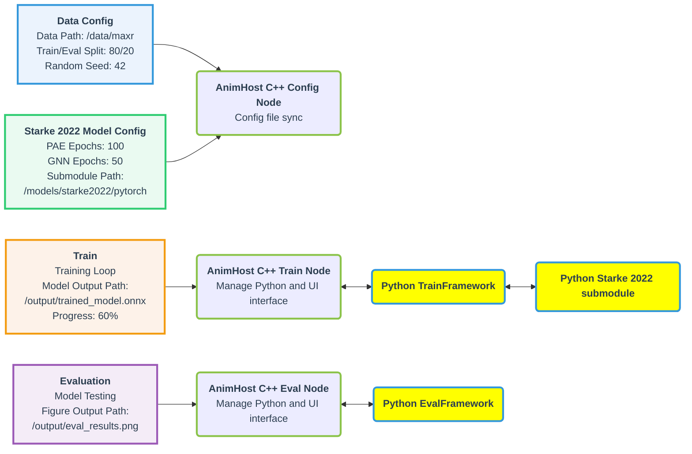

# Integration Pipeline

```mermaid
graph LR
    %% User Interface Nodes
    A["<b>Data Config</b><br/>Data Path: /data/maxr<br/>Train/Eval Split: 80/20<br/>Random Seed: 42"]
    B["<b>Starke 2022 Model Config</b><br/>PAE Epochs: 100<br/>GNN Epochs: 50<br/>Submodule Path:<br/>/models/starke2022/pytorch"]
    C["<b>Train</b><br/>Training Loop<br/>Model Output Path:<br/>/output/trained_model.onnx<br/>Progress: 60%"]
    D["<b>Evaluation</b><br/>Model Testing<br/>Figure Output Path:<br/>/output/eval_results.png"]
    
    %% Implementation Nodes
    E("<b>AnimHost C++ Config Node</b><br/>Config file sync")
    F("<b>AnimHost C++ Train Node</b><br/>Manage Python and UI interface")
    G("<b>AnimHost C++ Eval Node</b><br/>Manage Python and UI interface")
    
    %% Python Framework Nodes
    H("<b>Python TrainFramework</b>")
    I("<b>Python EvalFramework</b>")
    J("<b>Python Starke 2022 submodule</b>")
    
    %% Connections
    A --> E
    B --> E
    C --> F
    D --> G
    
    F <--> H
    G <--> I
    H <--> J
    
    %% Node Styling
    classDef dataNode fill:#ebf3fd,stroke:#3498db,stroke-width:3px,color:#2c3e50
    classDef modelNode fill:#eafaf1,stroke:#2ecc71,stroke-width:3px,color:#2c3e50
    classDef trainNode fill:#fdf2e9,stroke:#f39c12,stroke-width:3px,color:#2c3e50
    classDef evalNode fill:#f4ecf7,stroke:#9b59b6,stroke-width:3px,color:#2c3e50
    classDef cppNode fill:#fill:#90EE90,stroke:#8BC34A,stroke-width:3px,color:#2c3e50
    classDef pythonNode fill:#FFFF00,stroke:#3498db,stroke-width:3px,color:#2c3e50
    
    class A dataNode
    class B modelNode
    class C trainNode
    class D evalNode
    class E,F,G cppNode
    class H,I,J pythonNode
```