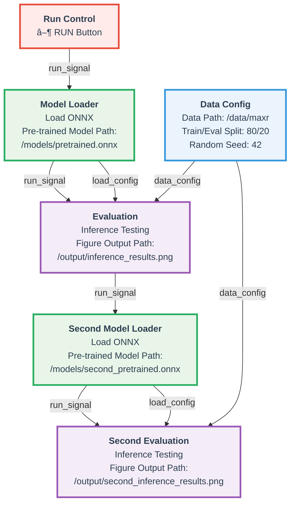

# Multi Evaluation Pipeline

```mermaid
graph TD
    %% Evaluation Pipeline Nodes
    A2["<b>Run Control</b><br/>â–¶ RUN Button"]
    B2["<b>Data Config</b><br/>Data Path: /data/maxr<br/>Train/Eval Split: 80/20<br/>Random Seed: 42"]
    G["<b>Model Loader</b><br/>Load ONNX<br/>Pre-trained Model Path:<br/>/models/pretrained.onnx"]
    H["<b>Evaluation</b><br/>Inference Testing<br/>Figure Output Path:<br/>/output/inference_results.png"]
    
    %% Second Evaluation Pipeline Nodes
    I["<b>Second Model Loader</b><br/>Load ONNX<br/>Pre-trained Model Path:<br/>/models/second_pretrained.onnx"]
    J["<b>Second Evaluation</b><br/>Inference Testing<br/>Figure Output Path:<br/>/output/second_inference_results.png"]
    
    %% Evaluation Pipeline Connections
    A2 -->|run_signal| G
    G -->|run_signal| H
    G -->|load_config| H
    B2 -->|data_config| H
    
    %% Second Evaluation Pipeline Connections
    H -->|run_signal| I
    I -->|run_signal| J
    I -->|load_config| J
    B2 -->|data_config| J
    
    %% Node Styling
    classDef runNode fill:#ffebea,stroke:#e74c3c,stroke-width:3px,color:#2c3e50
    classDef dataNode fill:#ebf3fd,stroke:#3498db,stroke-width:3px,color:#2c3e50
    classDef evalNode fill:#f4ecf7,stroke:#9b59b6,stroke-width:3px,color:#2c3e50
    classDef loaderNode fill:#e8f5e8,stroke:#27ae60,stroke-width:3px,color:#2c3e50
    
    class A2 runNode
    class B2 dataNode
    class H,J evalNode
    class G,I loaderNode
```