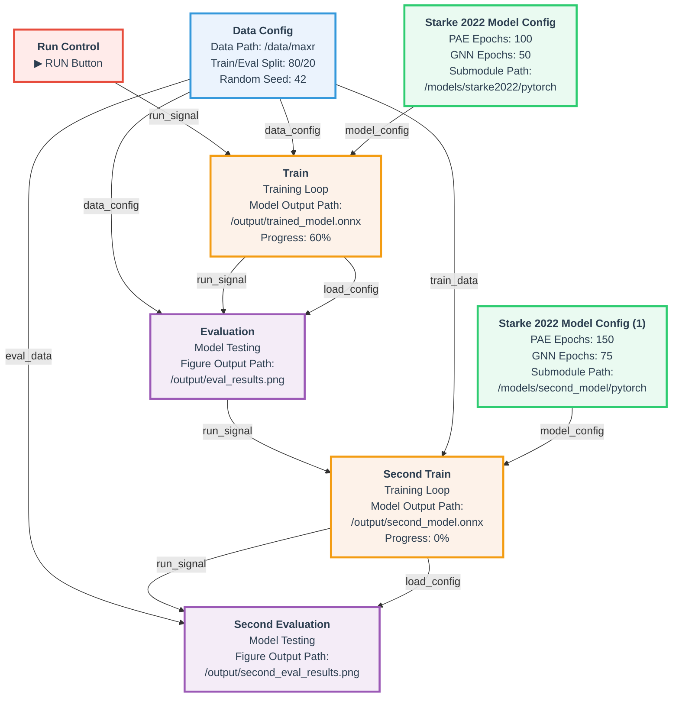

# Multi Training Pipeline

```mermaid
graph TD
    %% Training Pipeline Nodes
    A["<b>Run Control</b><br/>▶ RUN Button"]
    B["<b>Data Config</b><br/>Data Path: /data/maxr<br/>Train/Eval Split: 80/20<br/>Random Seed: 42"]
    C["<b>Starke 2022 Model Config</b><br/>PAE Epochs: 100<br/>GNN Epochs: 50<br/>Submodule Path:<br/>/models/starke2022/pytorch"]
    E["<b>Train</b><br/>Training Loop<br/>Model Output Path:<br/>/output/trained_model.onnx<br/>Progress: 60%"]
    F["<b>Evaluation</b><br/>Model Testing<br/>Figure Output Path:<br/>/output/eval_results.png"]
    
    %% Second Training Pipeline Nodes
    G["<b>Starke 2022 Model Config (1)</b><br/>PAE Epochs: 150<br/>GNN Epochs: 75<br/>Submodule Path:<br/>/models/second_model/pytorch"]
    I["<b>Second Train</b><br/>Training Loop<br/>Model Output Path:<br/>/output/second_model.onnx<br/>Progress: 0%"]
    J["<b>Second Evaluation</b><br/>Model Testing<br/>Figure Output Path:<br/>/output/second_eval_results.png"]
    
    %% Training Pipeline Connections
    A -->|run_signal| E
    B -->|data_config| E
    B -->|data_config| F
    C -->|model_config| E
    E -->|run_signal| F
    E -->|load_config| F
    
    %% Second Training Pipeline Connections
    F -->|run_signal| I
    B -->|train_data| I
    B -->|eval_data| J
    G -->|model_config| I
    I -->|run_signal| J
    I -->|load_config| J
    
    %% Node Styling
    classDef runNode fill:#ffebea,stroke:#e74c3c,stroke-width:3px,color:#2c3e50
    classDef dataNode fill:#ebf3fd,stroke:#3498db,stroke-width:3px,color:#2c3e50
    classDef modelNode fill:#eafaf1,stroke:#2ecc71,stroke-width:3px,color:#2c3e50
    classDef trainNode fill:#fdf2e9,stroke:#f39c12,stroke-width:3px,color:#2c3e50
    classDef evalNode fill:#f4ecf7,stroke:#9b59b6,stroke-width:3px,color:#2c3e50
    
    class A runNode
    class B dataNode
    class C,G modelNode
    class E,I trainNode
    class F,J evalNode
```