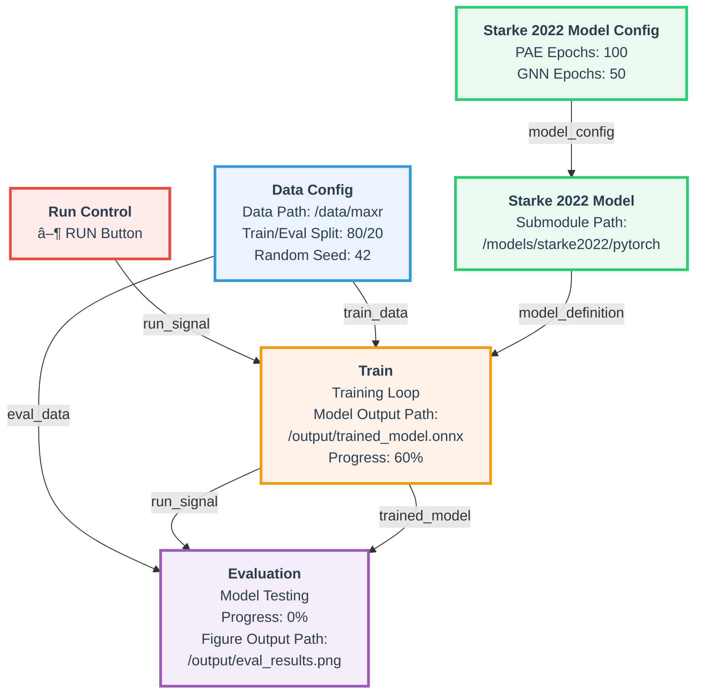

# Training Pipeline

```mermaid
graph TD
    %% Training Pipeline Nodes
    A["<b>Run Control</b><br/>â–¶ RUN Button"]
    B["<b>Data Config</b><br/>Data Path: /data/maxr<br/>Train/Eval Split: 80/20<br/>Random Seed: 42"]
    C["<b>Starke 2022 Model Config</b><br/>PAE Epochs: 100<br/>GNN Epochs: 50"]
    D["<b>Starke 2022 Model</b><br/>Submodule Path:<br/>/models/starke2022/pytorch"]
    E["<b>Train</b><br/>Training Loop<br/>Model Output Path:<br/>/output/trained_model.onnx<br/>Progress: 60%"]
    F["<b>Evaluation</b><br/>Model Testing<br/>Progress: 0%<br/>Figure Output Path:<br/>/output/eval_results.png"]
    
    %% Training Pipeline Connections
    A -->|run_signal| E
    B -->|train_data| E
    B -->|eval_data| F
    C -->|model_config| D
    D -->|model_definition| E
    E -->|run_signal| F
    E -->|trained_model| F
    
    %% Node Styling
    classDef runNode fill:#ffebea,stroke:#e74c3c,stroke-width:3px,color:#2c3e50
    classDef dataNode fill:#ebf3fd,stroke:#3498db,stroke-width:3px,color:#2c3e50
    classDef modelNode fill:#eafaf1,stroke:#2ecc71,stroke-width:3px,color:#2c3e50
    classDef trainNode fill:#fdf2e9,stroke:#f39c12,stroke-width:3px,color:#2c3e50
    classDef evalNode fill:#f4ecf7,stroke:#9b59b6,stroke-width:3px,color:#2c3e50
    
    class A runNode
    class B dataNode
    class C,D modelNode
    class E trainNode
    class F evalNode
```