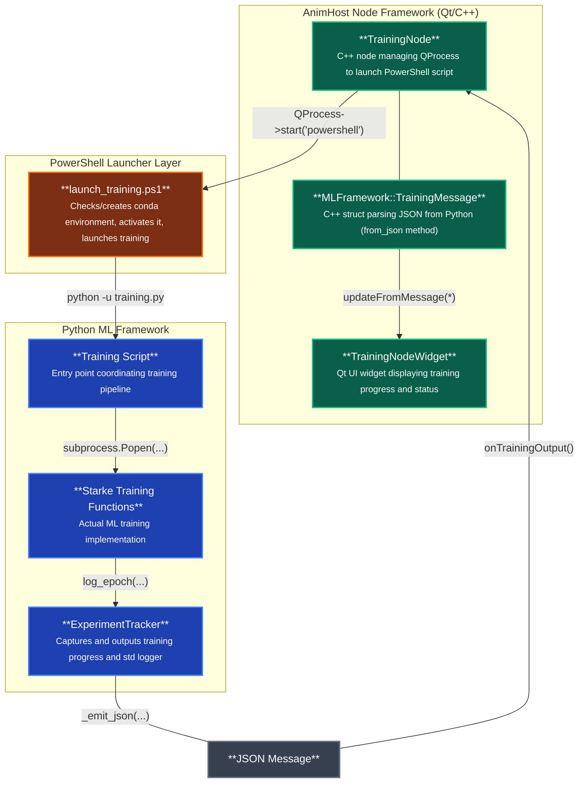

# How to run

## Requirements & First Run

**Options 1 & 2:** Require Windows with PowerShell and winget or conda
- First run automatically installs Miniconda if not present (handled by launcher script)
- Everything else (conda environments, dependencies) is automatically configured
- By using the automated launcher, you accept [Anaconda Terms of Service](https://www.anaconda.com/terms-of-service)

**Option 3:** Requires manual conda/miniconda installation and environment activation (works on all platforms)

## Option 1: AnimHost GUI (Windows only, C++ Integration Testing)

**Use this when:** Testing C++ TrainingNode changes OR validating full integration workflow

1. Build AnimHost as per instructions in the [top-level README](/README.md)
2. Launch the AnimHost.exe application
3. Load `TestScenes/TrainingPipeline.flow`
4. Execute the training pipeline through the node interface

**IMPORTANT:** AnimHost uses **deployed scripts** from the build output directory (`build/Release/python/ml_framework/`). Python code changes require a rebuild to be picked up by AnimHost. See option 2 for fast iteration on Python changes.

## Option 2: Standalone Launcher (Windows only, Python Development)

**Use this when:** Iterating on Python ML code without rebuilding AnimHost

**Advantage:** No build required - directly uses source scripts from `python/ml_framework/`

```powershell
python/ml_framework/launch_training.ps1
```

This runs training in the `animhost-ml-starke22` conda environment with real-time output streaming.

## Option 3: Direct Python Execution (All Platforms, Manual Environment)

**Use this when:** Testing without launcher automation OR working on non-Windows platforms

**Advantage:** Works on Linux/macOS, gives full control over environment

```powershell
cd python/ml_framework
python training.py
```

**Note:** Requires manual activation of `animhost-ml-starke22` conda environment first. The launch_training.ps1 install won't enable `conda activate` commands; you need to run `conda init` with proper permissions.

# Release Package Structure

When AnimHost is built, the Python ML framework is automatically copied to the build output directory. The final release package has this structure:

```
Release/
  AnimHost.exe
  *.dll (Qt plugins, vcpkg libraries)
  python/
    ml_framework/
      launch_training.ps1
      training.py
      environments/
        animhost-ml-starke22.yml
      (other ML framework files)
  TestScenes/
    TrainingPipeline.flow
    (other .flow test scenes)
```

# How to test

## Run all tests
```bash
cd python/ml_framework/tests
pytest tests/ -v
```

## Run specific test modules
```bash
# Test external training integration
pytest tests/test_external/test_example_training.py -v
```

# Developer Documentation



## Integration Overview

The TrainingPlugin bridges AnimHost's C++ node framework with Python ML training scripts via JSON inter-process communication.
* The TrainingNode launches a PowerShell launcher script using QProcess, which manages conda environment setup and activation before executing the Python training script.
* The Python training script will launch an additional subprocess when using an external experiment script.
* The ExperimentTracker provides structured logging from Python back to the UI. The ExperimentTracker also captures and shares external training script output and standard logger.

**Critical Interface Requirement**: Any changes to the JSON protocol must be synchronized between:
- `ExperimentTracker._emit_json()` method in Python (emits JSON with status, text, metrics fields)
- `MLFramework::TrainingMessage.from_json()` method in C++ (parses the same JSON structure)

This ensures consistent communication between the Python training pipeline and AnimHost's UI components. At this point, this implicit interface is preferred over a strictly enforced message structure for ease of iteration.

## External Training Script Integration

External training scripts (like Starke SIGGRAPH 2022's Network.py) are integrated as subprocesses with customized line parsers:

```python
# Example from starke_training.py
run_script_subprocess(
    script_name="Network.py",
    working_dir=gnn_path,
    model_name="Controller", 
    line_parser=lambda line, model_name: parse_training_output(line, model_name, tracker)
)
```

The `line_parser` function converts script-specific output formats into standardized JSON messages:
- Parses "Epoch 1 0.329..." → `tracker.log_epoch("Controller training", {"epoch": 1, "loss": 0.329})`
- Parses "Progress 23.42 %" → `tracker.log_percentage_progress("Controller training", 23.42)`

This architecture allows integration of any external training script by providing an appropriate line parser that translates its output format into the standard JSON protocol.

## Exposing External Script Parameters to AnimHost

To add new training hyperparameters to the AnimHost UI, synchronize changes across four locations:

1. **`AnimHost/animHost_Plugins/TrainingPlugin/Training/MLFrameworkTypes.h`** - Add field to your config struct and update `tie()`, `field_names()`, and `display_names()` arrays
2. **`python/ml_framework/config/model_configs.py`** - Add matching field to your config dataclass with validation in `validate()`
3. **`python/ml_framework/external/starke_training.py`** - Use config values to update external training scripts via `write_script_variables()`
4. **`python/ml_framework/starke_model_config.json`** - Add default values for example configurations

**UI widgets are auto-generated** by `ConfigWidget.h` based on field type: `int` → spinbox, `double` → validated text field (scientific notation supported), `QString` → text/path field, `bool` → checkbox.

**Key requirements**: Field types must match between C++ and Python (`double` ↔ `float`, `int` ↔ `int`), field order in `tie()` must match metadata arrays, and changes require rebuilding AnimHost.

**Example**: See [PR #53](https://github.com/FilmakademieRnd/AnimHost/pull/53) for an implementation adding learning rate and dropout parameters.