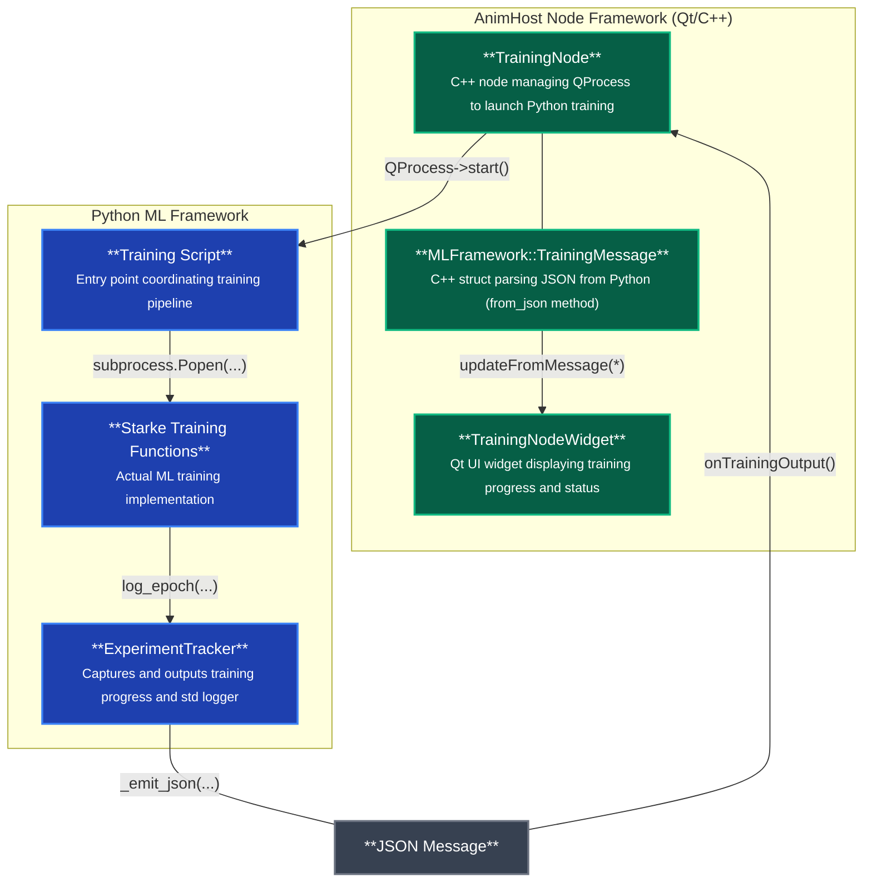

# How to run

## Option 1: Automated launcher (Recommended)
```powershell
cd python/ml_framework
launch_training.ps1
```

Or from the AnimHost root directory:
```powershell
python\ml_framework\launch_training.bat
```

This automatically activates the `animhost-ml-starke22` conda environment, runs training with real-time output streaming, and cleanly deactivates the environment when complete.

## Option 2: Direct Python execution (Legacy)
```powershell
cd python/ml_framework
python training.py
```
Note: Requires manual activation of `animhost-ml-starke22` conda environment first.

## Option 3: AnimHost GUI
1. Launch AnimHost application
2. Load `TestScenes/TrainingPipeline.flow`
3. Execute the training pipeline through the node interface

# How to test

## Run all tests
```bash
cd python/ml_framework/tests
pytest tests/ -v
```

## Run specific test modules
```bash
# Test experiment tracker only
pytest tests/test_experiment_tracker.py -v

# Test external training integration
pytest tests/test_external/test_example_training.py -v
```

# Developer Documentation



## Integration Overview

The TrainingPlugin bridges AnimHost's C++ node framework with Python ML training scripts via JSON inter-process communication. The TrainingNode launches a Python training processes using QProcess. The training process will launch an additional subprocess when using an external experiment script. The ExperimentTracker provides structured logging from Python back to the UI. The ExperimentTracker also captures and shares external training script output and standard logger.

**Critical Interface Requirement**: Any changes to the JSON protocol must be synchronized between:
- `ExperimentTracker._emit_json()` method in Python (emits JSON with status, text, metrics fields)
- `MLFramework::TrainingMessage.from_json()` method in C++ (parses the same JSON structure)

This ensures consistent communication between the Python training pipeline and AnimHost's UI components. At this point, this implicit interface is preferred over a strictly enforced message structure for ease of iteration.

## External Training Script Integration

External training scripts (like Starke SIGGRAPH 2022's Network.py) are integrated as subprocesses with customized line parsers:

```python
# Example from starke_training.py
run_script_subprocess(
    script_name="Network.py",
    working_dir=gnn_path,
    model_name="Controller", 
    line_parser=lambda line, model_name: parse_training_output(line, model_name, tracker)
)
```

The `line_parser` function converts script-specific output formats into standardized JSON messages:
- Parses "Epoch 1 0.329..." → `tracker.log_epoch("Controller training", {"epoch": 1, "loss": 0.329})`
- Parses "Progress 23.42 %" → `tracker.log_percentage_progress("Controller training", 23.42)`

This architecture allows integration of any external training script by providing an appropriate line parser that translates its output format into the standard JSON protocol.